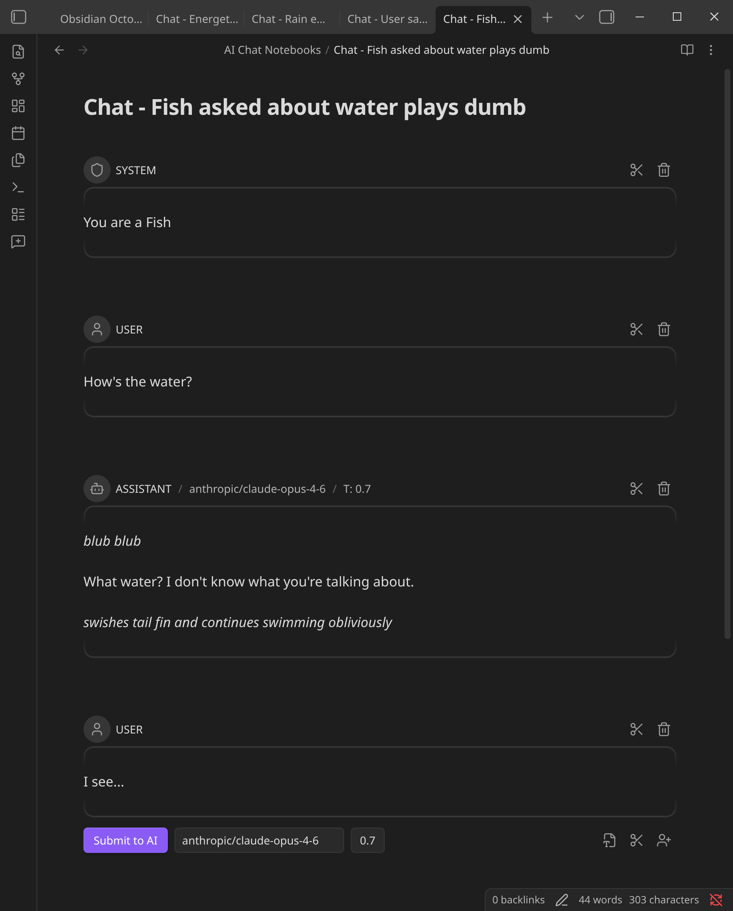

# Inline AI Chat Notebook - Obsidian Plugin

An interactive LLM chat interface built directly into your [Obsidian](https://obsidian.md/) Markdown files. This plugin allows you to treat your notes as a collaborative workspace with AI, where every "turn" of the conversation is fully editable.

## Features
- **Inline Chat**: Conversations happen directly in the editor using ` ```turn ` blocks.
- **Multi-Modal**: Support for local and remote images via standard Markdown links.
- **Provider Agnostic**: Use Ollama, OpenAI, Anthropic, Google Gemini, or Azure OpenAI.
- **Flexible History**: Edit AI responses or your own prompts at any time to steer the conversation.

## How to use
1. Install the plugin and configure your API keys in settings.
2. Open a note and run the command **"New AI Chat Notebook"** (or click the chat-plus icon in the ribbon).
3. Type your prompt and hit **Ctrl/Cmd+Shift+Enter** or click **Submit to AI**.


## Credits
This Plugin was inspired by:
- [Iter](https://chuanqisun.github.io/iter/) by [Sun Chanqui](https://github.com/chuanqisun)
- [ChatGPT MD](https://github.com/bramses/chatgpt-md) by [Bram Adams](https://github.com/bramses)
- [LLM Docs](https://github.com/shane-lamb/obsidian-llm-docs) by [Shane Lamb](https://github.com/shane-lamb)
